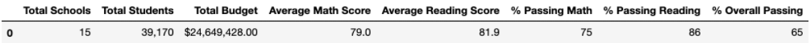
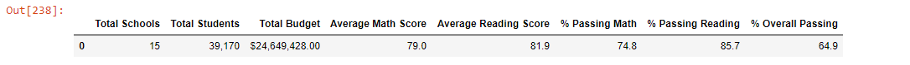

# School_District_Analysis
Analysis of school results with the use of Python through Anaconda with Jupyter Notebook and Pandas Library.

## Overview of the School District Analysis
In this challenge, I was tasked with sifting through data from various schools. I explored things such as test scores, funding, and performance across the school district. I pulled out data from Thomas High School to see how my data set would be affected. The purpose of this challenge was to highlight the schools that were excelling and the schools that needed help the most. The bulk of this analysis was based off of test scores for math and reading tests.

## Results

### Addressing the District Summary Difference
When we removed data from the 9th graders at Thomas High School, we noticied the average test score either remained the same or decreased across the board. In the first District Summary shown below, the scores with Thomas High School are shown. 

In this image, scores from Thomas High School have been deleted. In comparison to the image above, we can see that scores across the board went down or stayed the same in this newly revised district summary shownn below.

### Affects on School Summaries
