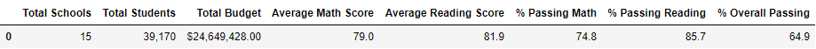

# School_District_Analysis
Analysis of school results with the use of Python through Anaconda with Jupyter Notebook and Pandas Library.

## Overview of the School District Analysis
In this challenge, I was tasked with sifting through data from various schools. I explored things such as test scores, funding, and performance across the school district. I pulled out testing data from 9th graders at Thomas High School to see how my data set would be affected. The purpose of this challenge was to highlight the schools that were excelling and the schools that needed help the most. The bulk of this analysis was based off of test scores for math and reading tests.

## Results

### Addressing the District Summary Difference
When we removed data from the 9th graders at Thomas High School, we noticied the average test score either remained the same or decreased across the board. In the first District Summary shown below, the scores with Thomas High School are shown. 

In this image, scores from Thomas High School have been deleted. In comparison to the image above, we can see that scores across the board went down or stayed the same in this newly revised district summary shownn below.

### Affects on School Summaries
The next thing we investigated was the school summaries. I wanted to see what affects if would have on Thomas High School and how the school would compare against others by taking out the testing scores for 9th graders. The picture below shows the overall passing % of each High School.

Above, we saw the old overall passing % data for high schools. In the figure below, we will see the revised data with 9th graders at Thomas High School omitted. In the new version below, we see that the overall passing rate for Thomas High School went from 65% in the figure above, all the way up to 90.6% in the figure below!

### Performance Relative to Other Schools with ninth grader scores changed
By replacing the ninth grader's scores at Thomas High School, we see a slight change in performance. However, the change in performance is so little that it does not affect the ranking of the current list. Thomas High School still remains number two behind Cabrera High School in terms of overall passing %. The graph of these results is shown below.

### Affects of replacing ninth-grade scores at Thomas High School

Math and Reading scores by grade?
- Grades of other High Schools were not affected. However, the grades at Thomas High School were all altered to NaN.

Scores by School Spending?
- The scores by school spending was hardly changed at all. In fact, the difference is less than 1%, so the difference in score and spending seemed negligible.

Scores by School Size?
- The scores compared to school size was once again not really noticeable. The difference was less than 1%.

Scores by School Type?
- The score by school type remained relatively even just like the scores by size and spending. The change was less than 1%.

## Summary
The removal of math and reading scores from 9th graders at Thomas High School did not have a huge impact on this analysis. As shown above in the affects section of this report, many of the changes were by less than 1%. However, several changes did stand out to me during this process.

* % Passing Reading went from 69.6% to 97.0%
* % Passing Math went from 66.9% to 93.1%
* % Overall Passing % went from 65.0% to 90.6%
* % Passing went down less than .05%

From this report, we saw how the change in test scores for 9th graders at Thomas High School impacted the entire district. In the grand scheme of things, its change was not very drastic. However, if more and more High Schools began to omit more data, we could begin to see some pretty drastic shifts in grades.

